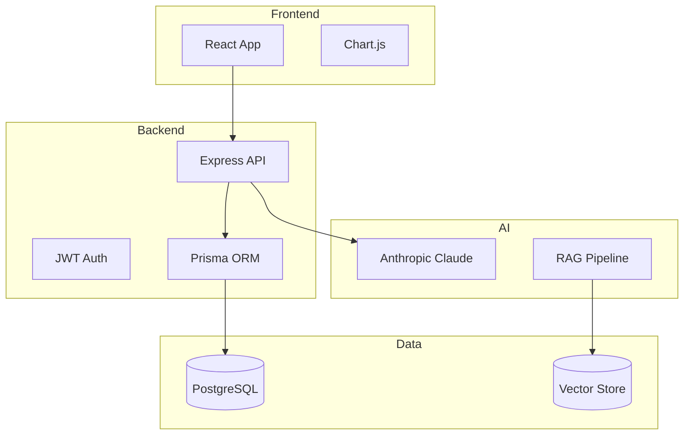

# Blueprint Agêntico: Framework Sistêmico para Avaliação de Maturidade e Especificação Automática de Produtos de IA

**SysMap Solutions**

---

## Resumo Executivo

O **Blueprint Agêntico** representa uma evolução significativa no campo de frameworks de avaliação de maturidade em Inteligência Artificial, oferecendo uma abordagem holística que integra diagnóstico organizacional, avaliação de produtos IA-First e geração automática de especificações técnicas por meio de agentes de IA.

Este framework metodológico fundamenta-se em modelos acadêmicos consolidados — MIT CISR Enterprise AI Maturity (Weill, Woerner & Sebastian, 2024), McKinsey Value Creation, SFIA Framework, NIST AI RMF e ADKAR/Prosci — e introduz o conceito inovador de **Transformação Agêntica**, que avalia a prontidão de organizações e produtos para o paradigma emergente de Multi-Agent Systems (MAS).

A plataforma oferece três módulos integrados:

1. **Avaliação de Maturidade Empresarial**: 16 dimensões e 108 perguntas estruturadas, com múltiplos avaliadores, seleção de dimensões por cargo e respostas "sem informação"
2. **Avaliação de Produtos IA-First**: 8 perguntas universais de Transformação Agêntica + 12 verticais setoriais
3. **Especificação Automática**: Geração de documentação técnica completa via IA generativa, biblioteca de relatórios IA e exportações multi-formato

> **Nota de atualização — Junho/2026**: esta tese narrativa foi preservada como documento extenso do Blueprint Agêntico. Para a síntese mais alinhada ao sistema implementado, consulte também `docs/TESE_BLUEPRINT_IA.md`; para o fluxo operacional ponta a ponta, consulte `docs/COMO_SISTEMA_FUNCIONA.md`.

**Palavras-chave**: Inteligência Artificial, Multi-Agent Systems, Maturidade Organizacional, Transformação Agêntica, Transformação Digital, ROI em IA, Especificação Automática, LLMs.

---

## 1. Introdução

### 1.1 Contexto e Motivação

A Inteligência Artificial emergiu como uma das tecnologias mais disruptivas da história recente, redefinindo modelos de negócio, processos operacionais e a própria natureza do trabalho humano. Segundo relatório da McKinsey Global Institute (2023), a IA generativa pode adicionar entre US$ 2,6 trilhões e US$ 4,4 trilhões anualmente à economia global.

No entanto, apesar do potencial transformador, estudos indicam que **apenas 11% das organizações alcançaram escala significativa com suas iniciativas de IA** (Gartner, 2023). Esta disparidade entre potencial e realização evidencia lacunas críticas:

1. **Ausência de metodologias estruturadas** para avaliar o estado atual de maturidade em IA
2. **Falta de frameworks específicos** para validação de produtos baseados em agentes autônomos
3. **Desconexão entre avaliação e execução** — diagnósticos não se traduzem em especificações acionáveis
4. **Carência de métricas quantitativas** para priorização de investimentos

O surgimento do paradigma de **Multi-Agent Systems** (MAS) intensifica esses desafios. Agentes de IA autônomos que colaboram para executar tarefas complexas representam uma mudança fundamental na arquitetura de soluções de IA, demandando novos critérios de avaliação e planejamento.

### 1.2 Problema de Pesquisa

Como as organizações podem:
1. Avaliar sistematicamente seu nível de prontidão e maturidade para adoção de IA?
2. Validar se seus produtos estão preparados para o paradigma de agentes autônomos?
3. Transformar diagnósticos em especificações técnicas acionáveis?
4. Maximizar o retorno sobre investimento (ROI) em iniciativas de IA?

### 1.3 Objetivos

**Objetivo Geral**: Desenvolver um framework abrangente que integre avaliação de maturidade, validação de produtos e especificação automática, permitindo às organizações diagnosticar, planejar e executar sua jornada de transformação com IA.

**Objetivos Específicos**:
1. Estruturar um modelo de avaliação multidimensional baseado em frameworks acadêmicos consolidados
2. Criar um módulo específico para avaliação de produtos IA-First e Multi-Agent Systems
3. Implementar geração automática de especificações técnicas usando IA generativa
4. Definir métricas quantitativas e fórmulas de cálculo para níveis de maturidade
5. Estabelecer projeções financeiras correlacionadas aos níveis de maturidade
6. Permitir benchmarking setorial e comparativo entre organizações

### 1.4 Contribuições da Tese

Este trabalho apresenta as seguintes contribuições originais:

1. **Integração de Frameworks**: Primeira síntese sistemática dos modelos MIT CISR, McKinsey, SFIA, NIST AI RMF e ADKAR para avaliação de maturidade em IA
2. **Conceito de Transformação Agêntica**: Introdução de métricas específicas para avaliar prontidão para Multi-Agent Systems
3. **Especificação Automática via IA**: Pioneirismo na geração automática de documentação técnica completa a partir de diagnósticos
4. **Modelo Matemático Integrado**: Fórmulas de cálculo que conectam maturidade, relevância de produto e projeções financeiras

---

## 2. Fundamentação Teórica

### 2.1 O Modelo MIT CISR de Maturidade em IA

O MIT Center for Information Systems Research (CISR) propôs em 2022-2024 um modelo de maturidade que classifica as organizações em cinco estágios evolutivos baseados em suas capacidades de IA (Weill, Woerner & Sebastian, 2024):

| Estágio | Denominação | Características Principais | % de Empresas |
|---------|-------------|---------------------------|---------------|
| 1 | **Inicial** | Experimentos isolados, sem estratégia formal | 35% |
| 2 | **Oportunista** | Projetos pontuais, ROI não mensurado | 30% |
| 3 | **Estruturado** | Governança definida, processos documentados | 20% |
| 4 | **Gerenciado** | IA integrada aos processos core, métricas consistentes | 11% |
| 5 | **Otimizado** | IA como diferencial competitivo, inovação contínua | 4% |

O modelo MIT CISR enfatiza que a progressão entre níveis não é linear e requer transformações em múltiplas dimensões simultaneamente: estratégia, tecnologia, pessoas e processos.

### 2.2 McKinsey Value Creation Framework

A McKinsey desenvolveu uma metodologia para identificação e quantificação de valor gerado por iniciativas de IA, estruturada em:

**Alavancas de Valor**:
- **Receita**: Novos produtos, personalização, cross-sell/up-sell
- **Custo**: Automação, eficiência operacional, redução de erros
- **Capital**: Otimização de inventário, manutenção preditiva

**Mapeamento por Unidade de Negócio**:
O framework enfatiza a importância de mapear casos de uso de IA por área funcional, permitindo priorização baseada em potencial de valor.

### 2.3 SFIA Framework (Skills Framework for the Information Age)

O SFIA é um framework internacional para mapeamento de competências técnicas, utilizado para:

- Inventariar habilidades existentes em IA/ML
- Identificar gaps de competências
- Definir planos de capacitação
- Estruturar planos de carreira

O Blueprint Agêntico incorpora a taxonomia SFIA para avaliar a dimensão "Talentos e Capacidades".

### 2.4 NIST AI Risk Management Framework (AI RMF)

O National Institute of Standards and Technology publicou em 2023 o AI RMF, que estabelece:

**Funções Centrais**:
1. **Govern**: Governança e accountability de sistemas de IA
2. **Map**: Mapeamento de contexto e riscos
3. **Measure**: Métricas e monitoramento
4. **Manage**: Gestão de riscos identificados

O Blueprint Agêntico integra estes conceitos nas dimensões de "Governança e Risco" e "Conformidade Regulatória".

### 2.5 ADKAR/Prosci Change Management Model

O modelo ADKAR estrutura a gestão de mudanças organizacionais em cinco elementos:

- **A**wareness: Consciência da necessidade de mudança
- **D**esire: Desejo de participar e apoiar a mudança
- **K**nowledge: Conhecimento de como mudar
- **A**bility: Habilidade para implementar a mudança
- **R**einforcement: Reforço para sustentar a mudança

A dimensão "Prontidão para Mudança" do Blueprint Agêntico operacionaliza este modelo para transformações com IA.

### 2.6 O Paradigma dos Multi-Agent Systems (MAS)

A evolução recente da IA generativa trouxe o conceito de **Sistemas Multi-Agentes**, onde múltiplos agentes de IA autônomos colaboram para executar tarefas complexas:

```
Evolução da Automação com IA:

1990s       2010s      2015s         2022+             2024+
  │           │          │             │                 │
  ▼           ▼          ▼             ▼                 ▼
Automação → RPA → Chatbots → Agentes → Multi-Agent
Tradicional              Simples   Autônomos   Systems
```

**Características de Multi-Agent Systems**:
- Autonomia: Operam sem supervisão humana contínua
- Colaboração: Múltiplos agentes trabalhando em conjunto
- Aprendizado: Melhoram iterativamente com feedback
- Orquestração: Integração com ferramentas e APIs externas

> "Agentes de IA não são ferramentas, são trabalhadores digitais autônomos capazes de raciocinar, planejar e executar tarefas complexas sem supervisão humana contínua." — Yann LeCun, Meta AI, 2024

O Blueprint Agêntico introduz o conceito de **Transformação Agêntica** para avaliar a prontidão de produtos e organizações para este novo paradigma.

---

## 3. Arquitetura do Blueprint Agêntico

### 3.1 Visão Geral da Plataforma

O Blueprint Agêntico é implementado como uma plataforma web completa com três módulos integrados:

```
┌─────────────────────────────────────────────────────────────────────────────┐
│                         BLUEPRINT AGÊNTICO PLATFORM                          │
├─────────────────────────────────────────────────────────────────────────────┤
│                                                                              │
│  ┌─────────────────────────────────────────────────────────────────────┐    │
│  │  MÓDULO 1: MATURIDADE EMPRESARIAL                                   │    │
│  │  ┌─────────────────────────────────────────────────────────────────┐│    │
│  │  │  16 Dimensões de Avaliação (108 perguntas)                      ││    │
│  │  │  • Estratégia e Liderança         • Operações e Processos       ││    │
│  │  │  • Dados e Tecnologia             • Inovação e Experimentação   ││    │
│  │  │  • Governança e Risco             • Valor de Negócio/ROI        ││    │
│  │  │  • Pessoas e Cultura              • Ecossistema/Parcerias       ││    │
│  │  │  • Valor por Unidade de Negócio   • Talentos e Capacidades      ││    │
│  │  │  • Conformidade Regulatória       • Prontidão para Mudança      ││    │
│  │  │  • Plataforma e Industrialização  • IA como Receita             ││    │
│  │  │  • Maturidade por Tipo de IA      • Eficácia de IA (MIT CISR)   ││    │
│  │  └─────────────────────────────────────────────────────────────────┘│    │
│  └─────────────────────────────────────────────────────────────────────┘    │
│                                                                              │
│  ┌─────────────────────────────────────────────────────────────────────┐    │
│  │  MÓDULO 2: PRODUTOS IA-FIRST (Transformação Agêntica)               │    │
│  │  ┌─────────────────────────────────────────────────────────────────┐│    │
│  │  │  8 Perguntas Universais de Transformação Agêntica (60%)         ││    │
│  │  │  • Maturidade p/ Agentes (20%)    • Escalabilidade (10%)        ││    │
│  │  │  • Impacto ROI/Receita (20%)      • Governança/Conform. (10%)   ││    │
│  │  │  • Redução de Custos (15%)        • Aprendizado/Evolução (5%)   ││    │
│  │  │  • Integração APIs (15%)          • Experiência Usuário (5%)    ││    │
│  │  ├─────────────────────────────────────────────────────────────────┤│    │
│  │  │  12 Verticais Setoriais × 6 perguntas cada (40%)                ││    │
│  │  │  • FinTech           • Healthcare       • AgTech                ││    │
│  │  │  • AI First          • E-commerce       • Tech/Consulting       ││    │
│  │  │  • EdTech            • Manufacturing    • LegalTech             ││    │
│  │  └─────────────────────────────────────────────────────────────────┘│    │
│  └─────────────────────────────────────────────────────────────────────┘    │
│                                                                              │
│  ┌─────────────────────────────────────────────────────────────────────┐    │
│  │  MÓDULO 3: ESPECIFICAÇÃO AUTOMÁTICA (IA Generativa)                 │    │
│  │  ┌─────────────────────────────────────────────────────────────────┐│    │
│  │  │  Geração via Claude (Anthropic) de:                             ││    │
│  │  │  • PRD (Product Requirements Document)                          ││    │
│  │  │  • Requisitos Funcionais (20-30 requisitos detalhados)          ││    │
│  │  │  • Requisitos Não Funcionais (ISO 25010)                        ││    │
│  │  │  • Arquitetura Técnica (diagramas Mermaid)                      ││    │
│  │  │  • Cronograma e Estimativas (custos por perfil)                 ││    │
│  │  │  • Blueprint de Construção (documento consolidado)              ││    │
│  │  └─────────────────────────────────────────────────────────────────┘│    │
│  └─────────────────────────────────────────────────────────────────────┘    │
│                                                                              │
└─────────────────────────────────────────────────────────────────────────────┘
```

### 3.2 Como o Sistema Funciona

O Blueprint Agêntico opera como uma plataforma de diagnóstico e execução:

1. **Cadastro e parametrização**: empresas, projetos, produtos, usuários, custos, provedores de IA e templates são configurados por administradores.
2. **Convite de avaliadores**: gestores selecionam avaliadores e dimensões. O sistema sugere dimensões pela matriz Cargo × Dimensão, reduzindo ruído e direcionando cada pessoa para temas nos quais tem repertório.
3. **Resposta guiada**: avaliadores acessam uma entrada restrita, respondem perguntas com critérios de 1 a 5, recebem esclarecimentos enriquecidos e podem marcar "sem informação" quando não possuem evidência.
4. **Consolidação**: o motor de cálculo gera progresso, score por dimensão, score geral ponderado, comparações por avaliador e análises por projeto/produto/empresa.
5. **Análise e decisão**: dashboards, análise de avaliações por dimensão e relatórios executivos mostram gaps, divergências, prioridades e oportunidades de ROI.
6. **Geração IA em background**: relatórios estratégicos e books completos rodam como jobs em background, são versionados em biblioteca e podem ser exportados.
7. **Especificação automática**: produtos IA-First podem gerar PRD, requisitos, arquitetura, estimativas e blueprint de construção a partir dos dados coletados.

### 3.3 Stack Tecnológico

A plataforma é construída com tecnologias modernas e escaláveis:

**Frontend**:
- React 18+ com Vite
- TailwindCSS para estilização
- Chart.js para visualizações
- React Router para navegação

**Backend**:
- Node.js com Express
- Prisma ORM
- SQLite (desenvolvimento) / PostgreSQL (produção)
- JWT para autenticação

**Inteligência Artificial**:
- API Anthropic (Claude Sonnet 4)
- Processamento multimodal (texto + imagens)
- Geração de documentação em Markdown

### 3.4 Modelo de Dados

A plataforma utiliza um modelo de dados relacional robusto:

```
┌──────────────┐     ┌──────────────┐     ┌──────────────┐
│   Empresa    │────<│   Projeto    │────<│   Avaliação  │
└──────────────┘     └──────────────┘     └──────────────┘
       │                    │                    │
       │                    │                    │
       ▼                    ▼                    ▼
┌──────────────┐     ┌──────────────┐     ┌──────────────┐
│   Usuário    │     │   Produto    │     │   Resposta   │
└──────────────┘     └──────────────┘     └──────────────┘
                           │
                           │
           ┌───────────────┼───────────────┐
           ▼               ▼               ▼
    ┌──────────────┐ ┌──────────────┐ ┌──────────────┐
    │  Avaliação   │ │ Especificação│ │   Arquivo    │
    │   Produto    │ │   Produto    │ │  Referência  │
    └──────────────┘ └──────────────┘ └──────────────┘
```

**Entidades Principais**:

| Entidade | Descrição | Relacionamentos |
|----------|-----------|-----------------|
| Empresa | Organização cliente | Possui N Usuários, N Projetos |
| Projeto | Iniciativa de IA | Pertence a 1 Empresa, possui N Avaliações |
| Produto | Produto IA-First | Pertence a 1 Projeto, possui N Avaliações |
| Avaliação | Assessment de maturidade | Realizada por 1 Usuário, possui N Respostas |
| Especificação | Documentação gerada | Pertence a 1 Produto, possui N Documentos |

---

## 4. Módulo 1: Avaliação de Maturidade Empresarial

### 4.1 As 12 Dimensões de Maturidade

Cada dimensão possui um peso específico no cálculo do score geral, refletindo sua importância relativa para a maturidade em IA:

| # | Dimensão | Peso | Perguntas | Fundamentação Teórica |
|---|----------|------|-----------|----------------------|
| 1 | **Estratégia e Liderança** | 10% | 6 | MIT CISR |
| 2 | **Dados e Tecnologia** | 10% | 6 | MIT CISR |
| 3 | **Governança e Risco** | 10% | 6 | NIST AI RMF |
| 4 | **Pessoas e Cultura** | 8% | 6 | SFIA |
| 5 | **Operações e Processos** | 8% | 6 | MIT CISR |
| 6 | **Inovação e Experimentação** | 8% | 6 | MIT CISR |
| 7 | **Valor de Negócio e ROI** | 10% | 8 | McKinsey |
| 8 | **Ecossistema e Parcerias** | 8% | 6 | MIT CISR |
| 9 | **Valor por Unidade de Negócio** | 7% | 6 | McKinsey/BCG |
| 10 | **Talentos e Capacidades** | 7% | 8 | SFIA/Gartner |
| 11 | **Conformidade Regulatória** | 7% | 8 | NIST AI RMF/EU AI Act |
| 12 | **Prontidão para Mudança** | 7% | 8 | ADKAR/Prosci/Kotter |

**Total**: 100% / 108 perguntas na versão atual da plataforma

### 4.2 Detalhamento das Dimensões

#### 4.2.1 Estratégia e Liderança (10%)

Avalia a visão estratégica, engajamento executivo e governança de alto nível para IA.

**Perguntas-chave**:
1. Existe uma estratégia clara de IA alinhada com objetivos de negócio?
2. O C-Level está engajado e patrocinando iniciativas de IA?
3. Há um orçamento dedicado e aprovado para IA?
4. Existe um Chief AI Officer ou responsável por IA?
5. A organização tem um roadmap de IA de 1-3 anos?
6. Há métricas de sucesso definidas para projetos de IA?

**Critérios de Avaliação** (exemplo para pergunta 1):

| Score | Nível | Critérios Observáveis |
|-------|-------|----------------------|
| 1 | Inexistente | Sem estratégia formal, sem documentação, iniciativas reativas |
| 2 | Inicial | Estratégia em desenvolvimento, documentação parcial |
| 3 | Definido | Estratégia documentada, alinhamento claro, comunicada internamente |
| 4 | Gerenciado | Estratégia integrada, revisão semestral, alinhamento com OKRs |
| 5 | Otimizado | Estratégia preditiva, antecipa mercado, inovação contínua |

#### 4.2.2 Dados e Tecnologia (10%)

Avalia a infraestrutura de dados, ferramentas de MLOps e capacidade tecnológica.

**Perguntas-chave**:
1. Existe um catálogo centralizado de dados?
2. Qual é a qualidade geral dos dados (completude, acurácia)?
3. Há ferramentas de MLOps implementadas (versionamento, CI/CD)?
4. A arquitetura suporta escalabilidade de modelos de IA?
5. Existem APIs padronizadas para acesso a dados?
6. Há infraestrutura de computação (GPU/TPU) disponível?

#### 4.2.3 Governança e Risco (10%)

Avalia políticas, conformidade e gestão de riscos específicos para IA.

**Perguntas-chave**:
1. Existe um framework de governança de IA definido?
2. Há conformidade com LGPD/GDPR nos projetos de IA?
3. Existe um comitê de ética em IA?
4. Há processos para identificar e mitigar vieses em modelos?
5. Existe gestão de riscos específica para projetos de IA?
6. Há auditoria regular dos modelos de IA em produção?

#### 4.2.4 Pessoas e Cultura (8%)

Avalia talentos, capacitação e cultura organizacional para IA.

**Perguntas-chave**:
1. Há talentos de IA na equipe (cientistas de dados, engenheiros de ML)?
2. Existe programa de capacitação em IA para funcionários?
3. A cultura organizacional é favorável à experimentação?
4. Há plano de carreira definido para profissionais de IA?
5. Existe colaboração entre áreas técnicas e de negócio?
6. A empresa consegue atrair e reter talentos de IA?

#### 4.2.5 Operações e Processos (8%)

Avalia a integração de IA nos processos operacionais.

**Perguntas-chave**:
1. Existem modelos de IA em produção gerando valor?
2. Há automação de processos com IA?
3. Existe SLA definido para modelos de IA?
4. Há integração de IA com sistemas legados?
5. Existe processo de deploy contínuo para modelos de IA?
6. Há monitoramento de performance dos modelos em produção?

#### 4.2.6 Inovação e Experimentação (8%)

Avalia a capacidade de inovação e experimentação em IA.

**Perguntas-chave**:
1. Existe um laboratório ou sandbox para experimentação de IA?
2. Há um processo para testar novas ideias de IA rapidamente?
3. A empresa acompanha e adota novas tecnologias de IA?
4. Existe colaboração com universidades, startups ou institutos?
5. Há processo para escalar experimentos bem-sucedidos?
6. A empresa contribui para a comunidade de IA?

#### 4.2.7 Valor de Negócio e ROI (10%)

Avalia o retorno sobre investimento e valor gerado pela IA.

**Perguntas-chave**:
1. Existe um modelo de medição de ROI para projetos de IA?
2. Qual é o retorno médio sobre investimento dos projetos de IA?
3. Há metodologia para quantificar impacto em receita/custos?
4. Projetos de IA estão alinhados com prioridades financeiras?
5. Existe priorização de projetos baseada em valor?
6. Como a empresa comunica valor da IA para stakeholders?
7. Qual a expectativa de crescimento de receita com IA (12 meses)?
8. Qual a expectativa de redução de custos operacionais com IA (12 meses)?

#### 4.2.8 Ecossistema e Parcerias (8%)

Avalia integrações, parcerias e uso de serviços externos.

**Perguntas-chave**:
1. A empresa utiliza plataformas cloud (AWS, Azure, GCP) para IA?
2. Há integração com ferramentas e serviços de terceiros?
3. Existe estratégia de make vs. buy para soluções de IA?
4. Há parcerias com consultorias, vendors ou startups de IA?
5. A empresa consegue integrar rapidamente novas soluções de IA?
6. Existe processo de avaliação e seleção de parceiros?

#### 4.2.9 Valor por Unidade de Negócio (7%)

Mapeia onde IA gera valor em cada área da organização.

**Perguntas-chave**:
1. Existe mapeamento de casos de uso de IA por unidade de negócio?
2. Cada unidade de negócio tem métricas específicas de valor gerado por IA?
3. Há priorização de investimentos baseada no potencial de valor por unidade?
4. As unidades de negócio têm autonomia para propor iniciativas de IA?
5. Existe compartilhamento de soluções de IA entre unidades de negócio?
6. Qual unidade de negócio está mais avançada em adoção de IA?

#### 4.2.10 Talentos e Capacidades (7%)

Análise detalhada de gaps de habilidades e plano de desenvolvimento.

**Perguntas-chave**:
1. Existe mapeamento quantitativo de profissionais de IA?
2. Há análise de gap entre capacidades atuais e necessidades futuras?
3. Existe estratégia clara de Build vs. Buy vs. Borrow para talentos?
4. Há programa estruturado de upskilling/reskilling em IA?
5. Qual o nível de senioridade da equipe de IA?
6. Existem papéis especializados além de Data Scientist?
7. Há métricas de produtividade e efetividade da equipe de IA?
8. Qual a taxa de turnover da equipe de IA?

#### 4.2.11 Conformidade Regulatória (7%)

Avalia alinhamento com regulações de IA, dados e setoriais.

**Perguntas-chave**:
1. Existe mapeamento completo de regulações aplicáveis à IA?
2. Há conformidade documentada com LGPD/GDPR em todos os projetos?
3. As regulações setoriais específicas são consideradas?
4. Existe preparação para regulações emergentes (EU AI Act)?
5. Há documentação de explicabilidade e transparência dos modelos?
6. Existem processos de auditoria de conformidade regulatória?
7. Há gestão de riscos regulatórios com planos de mitigação?
8. A área jurídica/compliance está capacitada e envolvida?

#### 4.2.12 Prontidão para Mudança (7%)

Avalia a capacidade organizacional de absorver transformações com IA.

**Perguntas-chave**:
1. Existe consciência organizacional sobre a necessidade de mudança?
2. Há desejo e motivação dos colaboradores para participar da transformação?
3. Existe mapeamento de resistências por área ou nível hierárquico?
4. Há uma rede de agentes de mudança ou champions de IA?
5. Existe capacidade organizacional para absorver mudanças?
6. Há mecanismos para sustentar e reforçar as mudanças implementadas?
7. A liderança intermediária apoia ativamente as mudanças de IA?
8. Existe um plano estruturado de gestão de mudança?

### 4.3 Metodologia de Avaliação

#### 4.3.1 Estrutura das Perguntas

Cada pergunta utiliza uma escala Likert de 1 a 5, com critérios específicos que descrevem comportamentos observáveis para cada nível.

#### 4.3.2 Múltiplos Avaliadores

O framework suporta múltiplos avaliadores por projeto:

- **Visão 360°**: Diferentes stakeholders avaliam as mesmas dimensões
- **Seleção de Áreas**: Cada avaliador escolhe quais dimensões tem conhecimento para responder
- **Consolidação**: Sistema calcula médias ponderadas considerando todos os avaliadores
- **Convites por E-mail**: Avaliadores podem ser convidados via link único

#### 4.3.3 Sistema de Convites

A plataforma implementa um sistema de convites para avaliações:

```
┌─────────────────────────────────────────────────────────────┐
│                    FLUXO DE CONVITE                          │
├─────────────────────────────────────────────────────────────┤
│                                                              │
│  Admin/Gestor                                                │
│       │                                                      │
│       ▼                                                      │
│  ┌─────────────┐                                             │
│  │ Criar       │                                             │
│  │ Convite     │                                             │
│  └─────────────┘                                             │
│       │                                                      │
│       ▼                                                      │
│  ┌─────────────┐     ┌─────────────┐                        │
│  │ Gerar Token │────>│ Enviar      │                        │
│  │ Único       │     │ E-mail      │                        │
│  └─────────────┘     └─────────────┘                        │
│                            │                                 │
│                            ▼                                 │
│                      Avaliador                               │
│                            │                                 │
│                            ▼                                 │
│                      ┌─────────────┐                        │
│                      │ Acessar     │                        │
│                      │ Link        │                        │
│                      └─────────────┘                        │
│                            │                                 │
│                            ▼                                 │
│                      ┌─────────────┐                        │
│                      │ Selecionar  │                        │
│                      │ Áreas       │                        │
│                      └─────────────┘                        │
│                            │                                 │
│                            ▼                                 │
│                      ┌─────────────┐                        │
│                      │ Responder   │                        │
│                      │ Assessment  │                        │
│                      └─────────────┘                        │
│                                                              │
└─────────────────────────────────────────────────────────────┘
```

---

## 5. Módulo 2: Avaliação de Produtos IA-First

### 5.1 Conceito de Transformação Agêntica

O segundo módulo foca na avaliação de produtos baseados em IA, especialmente aqueles que utilizam o paradigma de **Multi-Agent Systems**. A Transformação Agêntica representa a capacidade de um produto de:

1. **Operar autonomamente** sem intervenção humana contínua
2. **Escalar elasticamente** sob demanda
3. **Aprender e evoluir** com feedback
4. **Integrar-se** com ecossistemas de APIs e ferramentas
5. **Gerar valor mensurável** em ROI e redução de custos

### 5.2 Estrutura do Assessment de Produtos

O assessment é composto por dois blocos:

#### Bloco 1: 8 Perguntas Universais de Transformação Agêntica (60% do score)

| # | Categoria | Peso | Foco da Avaliação |
|---|-----------|------|-------------------|
| 1 | **Maturidade para Agentes Autônomos** | 20% | Capacidade de operação autônoma 24/7, Multi-Agent Systems |
| 2 | **Impacto no ROI e Receita** | 20% | ROI >100% no primeiro ano, novos modelos de negócio |
| 3 | **Redução de Custos Operacionais** | 15% | Redução ≥30% via automação agêntica |
| 4 | **Integração com APIs e Ecossistema** | 15% | MCP, webhooks, orquestração multi-sistema |
| 5 | **Escalabilidade e Elasticidade** | 10% | Suporte a crescimento 10x sem degradação |
| 6 | **Governança e Conformidade** | 10% | Auditoria, explicabilidade, anti-alucinação |
| 7 | **Aprendizado e Evolução** | 5% | Melhoria iterativa, zero-shot adaptation |
| 8 | **Experiência do Usuário** | 5% | Melhoria >20% em NPS/CSAT |

**Exemplo de Pergunta Universal**:

> **Pergunta 1 - Maturidade para Agentes Autônomos**:
> O projeto envolve a criação de agentes de IA autônomos (Multi-Agent Systems) que podem executar tarefas complexas sem intervenção humana contínua, operando 24/7 e melhorando iterativamente?

| Score | Critérios |
|-------|-----------|
| 1 | Não; o projeto é apenas automação RPA ou chatbots simples |
| 2 | Parcialmente; há alguns elementos de autonomia, mas com muita supervisão humana |
| 3 | Moderadamente; agentes podem executar tarefas com supervisão ocasional |
| 4 | Significativamente; agentes são principalmente autônomos com exceções tratadas por humanos |
| 5 | Totalmente; agentes são totalmente autônomos, auto-corrigíveis e aprendem com o tempo |

#### Bloco 2: 12 Verticais Setoriais (40% do score)

Cada vertical possui 6 perguntas específicas focadas em:
1. **ROI e Redução de Custos** específicos do setor
2. **Automação Agêntica** aplicada ao domínio
3. **APIs e Aceleradores** técnicos relevantes
4. **Viabilidade Técnica** da infraestrutura do cliente
5. **Prontidão do Cliente** para adoção
6. **Riscos e Compliance** setoriais

### 5.3 Verticais Disponíveis

| Vertical | Ícone | Foco Principal |
|----------|-------|----------------|
| **Tecnologia Financeira (FinTech)** | 💳 | Pagamentos, investimentos, empréstimos, compliance BACEN/CVM |
| **Inteligência Artificial (AI First)** | 🤖 | Agentes de IA verticais, Manus MCP, Multi-Agent Systems |
| **Tecnologia Educacional (EdTech)** | 📚 | Agentes tutores, correção automática, trilhas personalizadas |
| **LegalTech** | ⚖️ | Revisão de contratos, e-discovery, automação paralegal |
| **Saúde e Bem-Estar (Healthcare)** | 🏥 | Triagem, agendamento, análise de exames, HL7/FHIR |
| **E-commerce e Varejo** | 🛍️ | Atendimento pós-venda, recomendação, precificação dinâmica |
| **Manufatura e Indústria** | 🏭 | Manutenção preditiva, controle de qualidade, IoT/SCADA |
| **AgTech e Sustentabilidade** | 🌱 | Controle ambiental, otimização de recursos, ESG |
| **Tech e Consultoria** | 💻 | Fábrica Agêntica, Dev AI, 80% código gerado por IA |
| **Serviços Profissionais** | 🏢 | BPO, Contact Center, Atendimento, Facilities |
| **Logística e Supply Chain** | 🚚 | Transporte, Armazenagem, Last Mile, Gestão de Estoque |
| **Mobilidade e Smart Cities** | 🚗 | Estacionamentos, Frotas, Gestão de Tráfego, Infraestrutura Urbana |

### 5.4 Detalhamento das Verticais

#### 5.4.1 FinTech

**Perguntas específicas**:
1. O projeto projeta um ROI superior a 150% no primeiro ano e reduz os custos operacionais de back-office?
2. A solução utiliza Agentes de IA autônomos para substituir fluxos de trabalho manuais?
3. O projeto faz uso de aceleradores SysMap e APIs padronizadas para integrar sistemas legados bancários, reduzindo o tempo de desenvolvimento em pelo menos 50%?
4. A infraestrutura atual do cliente suporta a implementação da solução?
5. O cliente possui dados históricos de qualidade suficiente (min. 2 anos)?
6. A solução atende às regulamentações do setor financeiro (BACEN, CVM, LGPD)?

#### 5.4.2 AI First

**Perguntas específicas**:
1. O projeto demonstra um modelo de negócio onde o custo marginal de entrega cai para quase zero, gerando margens brutas superiores a 80%?
2. A solução é nativamente baseada em múltiplos Agentes de IA colaborativos (Multi-Agent Systems)?
3. O projeto utiliza o Manus MCP ou arquiteturas similares para orquestrar ferramentas externas?
4. A arquitetura proposta suporta múltiplos modelos de IA e permite substituição sem reengenharia?
5. O cliente possui maturidade digital (cloud, APIs, DevOps)?
6. A solução possui guardrails contra alucinações e plano de contingência?

#### 5.4.3 Tech & Consulting (Fábrica Agêntica)

**Perguntas específicas**:
1. O projeto reduz o Lead Time de desenvolvimento em 50% e os custos de QA em 40%?
2. A solução implementa Agentes Desenvolvedores (Dev AI) que geram, testam e documentam código autonomamente, visando 80% de código gerado por IA?
3. O projeto utiliza aceleradores de CI/CD, APIs de LLMs para code review e o framework Blueprint IA?
4. A infraestrutura de desenvolvimento do cliente permite integração com ferramentas de IA?
5. O cliente possui práticas de DevOps maduras e documentação de código?
6. A solução inclui revisão humana de código crítico e testes de segurança automatizados?

#### 5.4.4 Serviços Profissionais (Professional Services)

**Perguntas específicas**:
1. O projeto reduz o custo por atendimento/serviço em pelo menos 40% e aumenta a capacidade sem aumento proporcional de headcount?
2. A solução utiliza Agentes de Atendimento e Serviço que automatizam interações com clientes, triagem de demandas e resolução de tickets 24/7?
3. O projeto integra APIs de comunicação omnichannel (voz, chat, email, WhatsApp), CRM e sistemas de gestão de serviços?
4. A infraestrutura de atendimento do cliente (PABX, contact center, ticketing) permite integração com agentes de IA?
5. O cliente possui histórico de atendimentos estruturado, base de conhecimento documentada e equipe receptiva a automação?
6. A solução mantém SLAs de atendimento, possui escalação automática para humanos em casos complexos e não compromete o NPS?

#### 5.4.5 Logística e Supply Chain

**Perguntas específicas**:
1. O projeto reduz custos logísticos em pelo menos 20% (transporte, armazenagem, perdas) e melhora o OTIF em 15%?
2. A solução utiliza Agentes de Otimização Logística que planejam rotas, gerenciam estoque e alocam recursos de forma autônoma em tempo real?
3. O projeto integra APIs de rastreamento, previsão de demanda, ERPs/WMS e plataformas de e-commerce para visibilidade end-to-end?
4. A infraestrutura logística do cliente (TMS, WMS, rastreamento GPS, IoT) permite coleta de dados em tempo real?
5. O cliente possui histórico de operações logísticas estruturado, visibilidade de estoque e equipe aberta a otimização por IA?
6. A solução possui planos de contingência para falhas, não interrompe operações críticas e considera sazonalidades?

#### 5.4.6 Mobilidade e Smart Cities

**Perguntas específicas**:
1. O projeto aumenta o giro de vagas/ativos em pelo menos 25%, reduz o tempo de busca/espera em 40% e melhora a receita por ativo gerenciado?
2. A solução utiliza Agentes de Gestão de Mobilidade que otimizam alocação de vagas, pricing dinâmico e controle de acesso de forma autônoma?
3. O projeto integra APIs de navegação (Google Maps, Waze), sistemas de pagamento digital, controle de acesso (LPR) e apps de mobilidade?
4. A infraestrutura do cliente (sensores IoT, câmeras LPR, cancelas, totens, conectividade) permite coleta de dados em tempo real?
5. O cliente possui histórico de ocupação, fluxo de veículos e transações estruturado, além de equipe receptiva a IA e automação?
6. A solução possui alta disponibilidade (99.9%), fallback manual para falhas e atende normas de privacidade (LGPD para placas)?

---

## 6. Módulo 3: Especificação Automática

### 6.1 Visão Geral

O módulo de Especificação Automática utiliza IA Generativa (Claude da Anthropic) para transformar as informações do produto e os resultados das avaliações em documentação técnica completa.

```
┌─────────────────────────────────────────────────────────────────────┐
│                  PIPELINE DE ESPECIFICAÇÃO AUTOMÁTICA                │
├─────────────────────────────────────────────────────────────────────┤
│                                                                      │
│   ┌──────────────┐     ┌──────────────┐     ┌──────────────┐        │
│   │   Produto    │     │  Avaliações  │     │   Arquivos   │        │
│   │   (dados)    │     │  (scores)    │     │  Referência  │        │
│   └──────┬───────┘     └──────┬───────┘     └──────┬───────┘        │
│          │                    │                    │                 │
│          └────────────────────┼────────────────────┘                 │
│                               │                                      │
│                               ▼                                      │
│                    ┌──────────────────────┐                          │
│                    │   Montagem de        │                          │
│                    │   Contexto           │                          │
│                    └──────────┬───────────┘                          │
│                               │                                      │
│                               ▼                                      │
│          ┌────────────────────────────────────────┐                  │
│          │           API Anthropic (Claude)        │                  │
│          │         claude-sonnet-4-20250514        │                  │
│          └────────────────────┬───────────────────┘                  │
│                               │                                      │
│            ┌──────────────────┼──────────────────┐                   │
│            │                  │                  │                   │
│            ▼                  ▼                  ▼                   │
│     ┌──────────┐       ┌──────────┐       ┌──────────┐              │
│     │   PRD    │       │ Req.Func │       │ Req.NFunc│              │
│     └──────────┘       └──────────┘       └──────────┘              │
│            │                  │                  │                   │
│            ▼                  ▼                  ▼                   │
│     ┌──────────┐       ┌──────────┐       ┌──────────┐              │
│     │  Arquit. │       │ Cronogr. │       │ Blueprint│              │
│     └──────────┘       └──────────┘       └──────────┘              │
│                               │                                      │
│                               ▼                                      │
│                    ┌──────────────────────┐                          │
│                    │  Exportação          │                          │
│                    │  HTML / MD / JSON    │                          │
│                    └──────────────────────┘                          │
│                                                                      │
└─────────────────────────────────────────────────────────────────────┘
```

### 6.2 Documentos Gerados

#### 6.2.1 PRD (Product Requirements Document)

**Estrutura**:
1. Resumo Executivo (máx. 3 parágrafos)
2. Visão e Objetivos (OKRs sugeridos)
3. Personas e Usuários (2-3 personas detalhadas)
4. User Stories Principais (8-12 histórias com critérios de aceite)
5. Escopo do MVP (IN/OUT)
6. Métricas de Sucesso (KPIs com metas 30/60/90 dias)
7. Riscos e Mitigações (Top 5 riscos)
8. Cronograma de Alto Nível

#### 6.2.2 Requisitos Funcionais

**Estrutura** (20-30 requisitos):
- ID (RF-XXX)
- Nome descritivo
- Descrição detalhada
- Prioridade MoSCoW (Must/Should/Could/Won't)
- Complexidade (Baixa/Média/Alta)
- Critérios de Aceite
- Dependências

**Módulos cobertos**:
- Autenticação e Autorização
- Interface do Usuário Principal
- Processamento de IA/ML
- Integrações e APIs
- Relatórios e Dashboards
- Administração e Configuração

#### 6.2.3 Requisitos Não Funcionais (ISO 25010)

**Categorias**:
1. **Performance**: Tempo de resposta, throughput, latência de APIs de IA
2. **Escalabilidade**: Usuários simultâneos, volume de dados, estratégia de scaling
3. **Disponibilidade**: SLA, RPO, RTO, estratégia de DR
4. **Segurança**: Autenticação, criptografia, conformidade
5. **Usabilidade**: Acessibilidade, responsividade
6. **Manutenibilidade**: Padrões de código, testabilidade, observabilidade
7. **Confiabilidade de IA**: Taxa de acerto, tratamento de alucinações, fallback humano

#### 6.2.4 Arquitetura Técnica

**Seções**:
1. Visão Geral da Arquitetura
2. Stack Tecnológico Recomendado (Frontend, Backend, Banco de Dados, IA, Cloud)
3. Diagrama de Componentes (Mermaid)
4. Fluxos de Dados Principais
5. Integrações
6. Segurança
7. Observabilidade
8. Estimativa de Custos de Infraestrutura

**Exemplo de Diagrama Mermaid**:


#### 6.2.5 Cronograma e Estimativas

**Estrutura**:
1. Resumo Executivo (duração, esforço, custo, equipe)
2. Fases do Projeto detalhadas
3. Cronograma Visual (Gantt em Mermaid)
4. Marcos (Milestones)
5. Equipe Recomendada
6. Resumo Financeiro
7. Premissas e Riscos

**Perfis de Custo Configuráveis**:

| Perfil | Custo/Hora (R$) |
|--------|-----------------|
| Desenvolvedor Júnior | 80 |
| Desenvolvedor Pleno | 120 |
| Desenvolvedor Sênior | 180 |
| Tech Lead | 220 |
| Arquiteto | 280 |
| Product Owner | 200 |
| Designer UX/UI | 150 |
| QA Engineer | 100 |
| DevOps Engineer | 180 |
| Data Scientist | 200 |
| ML Engineer | 220 |

#### 6.2.6 Blueprint de Construção

**Documento consolidado** para a equipe de desenvolvimento:
1. Capa e Identificação
2. Sumário Executivo
3. Escopo da Entrega (IN/OUT)
4. Arquitetura em Uma Página
5. Backlog Priorizado
6. Definições Técnicas
7. Checklist de Qualidade
8. Critérios de Done
9. Plano de Entregas
10. Contatos e Responsabilidades
11. Glossário
12. Anexos

### 6.3 Suporte a Arquivos de Referência

O módulo suporta upload de arquivos que enriquecem o contexto da geração:

**Tipos suportados**:
- **Documentos de texto**: TXT, PDF (extração automática de texto)
- **Imagens**: PNG, JPG, GIF, WebP (enviadas à API Claude para análise visual)

**Categorias de arquivos**:
- Geral
- Mockup (wireframes e protótipos visuais)
- Fluxo (diagramas de processo)
- Requisito (documentos de especificação existentes)
- Referência (materiais de apoio)

**Fluxo de processamento**:
1. Upload do arquivo pelo usuário
2. Extração de texto (para documentos) ou codificação base64 (para imagens)
3. Inclusão no contexto enviado à API
4. Claude analisa visualmente as imagens e incorpora elementos na especificação

### 6.4 Custos da API

| Item | Valor |
|------|-------|
| Modelo | Claude Sonnet 4 |
| Custo entrada | ~$3/milhão tokens |
| Custo saída | ~$15/milhão tokens |
| Tokens por especificação | 25.000-50.000 |
| **Custo por especificação** | **$0.30 - $0.60** |

---

## 7. Modelo Matemático e Fórmulas de Cálculo

### 7.1 Cálculo do Score de Maturidade Empresarial

#### 7.1.1 Score por Área

O score de cada área é calculado pela média aritmética simples das respostas às perguntas daquela área:

$$S_{área} = \frac{\sum_{i=1}^{n} R_i}{n}$$

Onde:
- $S_{área}$ = Score da área
- $R_i$ = Resposta da pergunta $i$ (valor de 1 a 5)
- $n$ = Número de perguntas respondidas na área

#### 7.1.2 Score Geral de Maturidade

O score geral é calculado pela média ponderada dos scores de todas as áreas:

$$S_{maturidade} = \frac{\sum_{j=1}^{12} (S_{área_j} \times P_j)}{\sum_{j=1}^{12} P_j}$$

Onde:
- $S_{maturidade}$ = Score geral de maturidade (1 a 5)
- $S_{área_j}$ = Score da área $j$
- $P_j$ = Peso da área $j$ (conforme tabela de pesos)

#### 7.1.3 Consolidação de Múltiplos Avaliadores

$$S_{área}^{consolidado} = \frac{\sum_{k=1}^{m} S_{área_k}}{m}$$

Onde:
- $m$ = Número de avaliadores que responderam a área
- $S_{área_k}$ = Score da área dado pelo avaliador $k$

### 7.2 Classificação dos Níveis de Maturidade

| Faixa de Score | Nível | Classificação | Descrição |
|----------------|-------|---------------|-----------|
| 1.00 - 1.49 | Inicial | Iniciante | Organização sem estratégia formal de IA |
| 1.50 - 2.49 | Oportunista | Básico | Projetos isolados, sem governança |
| 2.50 - 3.49 | Estruturado | Intermediário | Governança definida, processos em evolução |
| 3.50 - 4.49 | Gerenciado | Avançado | IA integrada, métricas consistentes |
| 4.50 - 5.00 | Otimizado | Expert | IA como core do negócio, inovação contínua |

### 7.3 Cálculo do Score de Relevância do Produto

O score final de relevância combina os dois blocos de avaliação:

$$S_{relevância} = (S_{agêntico} \times 0.60) + (S_{verticais} \times 0.40)$$

#### 7.3.1 Score de Transformação Agêntica (60%)

$$S_{agêntico} = \sum_{i=1}^{8} (R_i \times P_i)$$

Onde:
- $R_i$ = Resposta da pergunta universal $i$ (1-5)
- $P_i$ = Peso da pergunta $i$

| Pergunta | Peso |
|----------|------|
| Maturidade para Agentes | 20% |
| Impacto ROI/Receita | 20% |
| Redução de Custos | 15% |
| Integração APIs | 15% |
| Escalabilidade | 10% |
| Governança | 10% |
| Aprendizado | 5% |
| Experiência Usuário | 5% |

#### 7.3.2 Score de Verticais (40%)

$$S_{verticais} = \frac{\sum_{j=1}^{v} S_{vertical_j}}{v}$$

Onde:
- $v$ = Número de verticais selecionadas e avaliadas
- $S_{vertical_j}$ = Média das 6 perguntas da vertical $j$

### 7.4 Classificação de Produtos

| Score | Classificação | Recomendação |
|-------|---------------|--------------|
| 1.00 - 2.00 | Baixa Relevância | Reformular proposta ou descontinuar |
| 2.01 - 3.00 | Relevância Moderada | Pivotar ou ajustar escopo |
| 3.01 - 4.00 | Alta Relevância | Priorizar para desenvolvimento |
| 4.01 - 5.00 | Relevância Máxima | Fast-track, investimento prioritário |

---

## 8. Projeções Financeiras por Nível de Maturidade

### 8.1 Correlação entre Maturidade e Retorno Financeiro

Estudos empíricos demonstram correlação positiva entre maturidade em IA e resultados financeiros:

| Nível | Crescimento Receita | Redução Custos | ROI Esperado | Time-to-ROI |
|-------|---------------------|----------------|--------------|-------------|
| 1 - Inicial | -2% | -2% | 0% | 18-24 meses |
| 2 - Oportunista | +2% | -5% | 100% | 12-18 meses |
| 3 - Estruturado | +6% | -10% | 200% | 9-12 meses |
| 4 - Gerenciado | +12% | -18% | 400% | 6-9 meses |
| 5 - Otimizado | +22% | -28% | 700% | 3-6 meses |

### 8.2 Modelo de Projeção de ROI

$$ROI = \frac{(Receita_{incremental} + Custos_{reduzidos}) - Investimento_{IA}}{Investimento_{IA}} \times 100$$

Onde:
- $Receita_{incremental}$ = Receita adicional gerada por IA
- $Custos_{reduzidos}$ = Economia operacional com automação
- $Investimento_{IA}$ = Total investido em tecnologia, talentos e infraestrutura

### 8.3 Curva de Valor Acumulado

```
Valor
Gerado
   │
   │                                           ╱ Nível 5 (Otimizado)
   │                                      ╱───╱
   │                                 ╱───╱
   │                            ╱───╱     Nível 4 (Gerenciado)
   │                       ╱───╱
   │                  ╱───╱          Nível 3 (Estruturado)
   │             ╱───╱
   │        ╱───╱               Nível 2 (Oportunista)
   │   ╱───╱
   │╱─────────────────────────────── Nível 1 (Inicial)
   └──────────────────────────────────────────────────► Tempo
```

---

## 9. Dashboards e Visualizações

### 9.1 Dashboard Geral

Visão consolidada de todas as empresas e projetos:
- Total de empresas cadastradas
- Total de projetos e produtos
- Avaliações concluídas vs. em andamento
- Score médio de maturidade
- Distribuição por nível de maturidade

### 9.2 Dashboard de Projeto

Visão detalhada de um projeto específico:
- Gráfico Radar com scores por dimensão
- Gráfico de Barras comparativo
- Score consolidado de múltiplos avaliadores
- Evolução temporal (se houver múltiplas avaliações)
- Recomendações automáticas por dimensão

### 9.3 Dashboard de Produto

Visão detalhada de um produto IA-First:
- Score de Transformação Agêntica
- Score por Vertical
- Score de Relevância Final
- Classificação do produto
- Comparativo com outros produtos do projeto

### 9.4 Dashboard de Ranking de Projetos

Comparativo entre projetos:
- Ranking por score de maturidade
- Distribuição por setor
- Top performers
- Áreas de melhoria comuns

### 9.5 Dashboard Financeiro

Visão financeira do portfólio de produtos:
- Custo total estimado de construção
- Retorno anual esperado
- Timeline de ativação
- ROI projetado
- Gráfico de Gantt do portfólio

---

## 10. Recomendações por Nível de Maturidade

### 10.1 Nível 1 (Inicial) → Nível 2 (Oportunista)

**Foco**: Criar consciência e estrutura básica

**Ações recomendadas**:
- [ ] Definir sponsor executivo para IA
- [ ] Identificar 2-3 casos de uso com ROI mensurável
- [ ] Estabelecer governança mínima de dados
- [ ] Iniciar programa de capacitação básica
- [ ] Criar primeiro orçamento dedicado
- [ ] Mapear talentos existentes

**Métricas de sucesso**:
- 1 projeto piloto em andamento
- Sponsor executivo nomeado
- Orçamento aprovado

### 10.2 Nível 2 (Oportunista) → Nível 3 (Estruturado)

**Foco**: Profissionalizar e escalar

**Ações recomendadas**:
- [ ] Documentar estratégia de IA alinhada ao negócio
- [ ] Implementar MLOps básico
- [ ] Criar centro de excelência em IA
- [ ] Estabelecer métricas de sucesso padronizadas
- [ ] Definir framework de governança
- [ ] Implementar catálogo de dados

**Métricas de sucesso**:
- 3+ projetos em produção
- ROI positivo documentado
- Processos de MLOps funcionais

### 10.3 Nível 3 (Estruturado) → Nível 4 (Gerenciado)

**Foco**: Integrar e otimizar

**Ações recomendadas**:
- [ ] Integrar IA aos processos core
- [ ] Implementar governança avançada e compliance
- [ ] Escalar soluções bem-sucedidas
- [ ] Desenvolver parcerias estratégicas
- [ ] Criar dashboards de valor por unidade de negócio
- [ ] Implementar programa de upskilling massivo

**Métricas de sucesso**:
- IA em processos críticos
- ROI >200%
- Conformidade regulatória certificada

### 10.4 Nível 4 (Gerenciado) → Nível 5 (Otimizado)

**Foco**: Inovar e liderar

**Ações recomendadas**:
- [ ] Experimentar com tecnologias emergentes (Multi-Agent Systems)
- [ ] Criar produtos IA-First
- [ ] Estabelecer-se como referência no setor
- [ ] Contribuir para comunidade e ecossistema
- [ ] Implementar hiperautomação
- [ ] Desenvolver capacidades preditivas

**Métricas de sucesso**:
- Liderança reconhecida no setor
- ROI >700%
- Produtos IA-First em produção

---

## 11. Benchmarking e Análise Comparativa

### 11.1 Metodologia de Benchmarking

O Blueprint Agêntico permite comparar organizações em três dimensões:

1. **Benchmark Setorial**: Comparação com médias do setor de atuação
2. **Benchmark por Porte**: Comparação com empresas de porte similar
3. **Benchmark por Dimensão**: Identificação de gaps específicos

### 11.2 Indicadores de Posicionamento

| Indicador | Definição | Cálculo |
|-----------|-----------|---------|
| **Percentil** | Posição relativa no setor | % de empresas abaixo do score |
| **Gap to Leader** | Distância para o líder | $Score_{líder} - Score_{empresa}$ |
| **Top 25%** | Acima do terceiro quartil | $Score > Q_3$ |
| **Bottom 25%** | Abaixo do primeiro quartil | $Score < Q_1$ |

### 11.3 Matriz de Priorização

```
                    Importância Estratégica
                    Baixa          Alta
              ┌──────────────┬──────────────┐
        Alto  │   MANTER     │  EXCELÊNCIA  │
Gap de        │  (investir   │  (prioridade │
Score         │   moderado)  │   máxima)    │
              ├──────────────┼──────────────┤
        Baixo │   MONITORAR  │  PRIORIZAR   │
              │  (manter     │  (investir   │
              │   vigilância)│   agora)     │
              └──────────────┴──────────────┘
```

---

## 12. Implementação e Roadmap

### 12.1 Arquitetura de Implementação

```
┌─────────────────────────────────────────────────────────────────────┐
│                      ARQUITETURA DO SISTEMA                          │
├─────────────────────────────────────────────────────────────────────┤
│                                                                      │
│  ┌─────────────────────────────────────────────────────────────┐    │
│  │                        FRONTEND                              │    │
│  │  ┌─────────┐ ┌─────────┐ ┌─────────┐ ┌─────────┐           │    │
│  │  │ React   │ │ Vite    │ │Tailwind │ │Chart.js │           │    │
│  │  │ 18+     │ │ 5+      │ │ CSS 3+  │ │ 4+      │           │    │
│  │  └─────────┘ └─────────┘ └─────────┘ └─────────┘           │    │
│  └─────────────────────────────────────────────────────────────┘    │
│                               │                                      │
│                               │ HTTP/REST                            │
│                               ▼                                      │
│  ┌─────────────────────────────────────────────────────────────┐    │
│  │                        BACKEND                               │    │
│  │  ┌─────────┐ ┌─────────┐ ┌─────────┐ ┌─────────┐           │    │
│  │  │ Node.js │ │ Express │ │ Prisma  │ │ JWT     │           │    │
│  │  │ 20+     │ │ 4+      │ │ 5+      │ │ Auth    │           │    │
│  │  └─────────┘ └─────────┘ └─────────┘ └─────────┘           │    │
│  └─────────────────────────────────────────────────────────────┘    │
│                    │                         │                       │
│                    │                         │                       │
│                    ▼                         ▼                       │
│  ┌──────────────────────┐   ┌──────────────────────────────────┐   │
│  │      DATABASE        │   │         EXTERNAL APIS             │   │
│  │  ┌────────────────┐  │   │  ┌────────────────────────────┐  │   │
│  │  │  PostgreSQL    │  │   │  │  Anthropic (Claude)        │  │   │
│  │  │  / SQLite      │  │   │  │  claude-sonnet-4-20250514  │  │   │
│  │  └────────────────┘  │   │  └────────────────────────────┘  │   │
│  └──────────────────────┘   └──────────────────────────────────┘   │
│                                                                      │
└─────────────────────────────────────────────────────────────────────┘
```

### 12.2 Estrutura do Projeto

```
blueprint-ia/
├── frontend/                  # React + Vite + TailwindCSS
│   ├── src/
│   │   ├── components/        # Componentes reutilizáveis
│   │   ├── contexts/          # React Contexts (Auth, Theme)
│   │   ├── pages/             # Páginas da aplicação
│   │   ├── services/          # APIs e serviços
│   │   └── utils/             # Utilitários
│   └── package.json
│
├── backend/                   # Node.js + Express + Prisma
│   ├── src/
│   │   ├── routes/            # Rotas da API
│   │   ├── middlewares/       # Middlewares (auth, validate)
│   │   ├── services/          # Serviços (anthropic, email)
│   │   └── validators/        # Validação de schemas
│   ├── prisma/
│   │   ├── schema.prisma      # Modelo de dados
│   │   ├── seed.js            # Dados iniciais
│   │   └── seed-custos.js     # Configuração de custos
│   └── package.json
│
├── docs/                      # Documentação
│   ├── TESE_BLUEPRINT_AGENTICO.md
│   └── ESPECIFICACAO_AUTOMATICA.md
│
└── README.md
```

### 12.3 Como Executar

**Backend**:
```bash
cd backend
npm install
npx prisma migrate dev --name init
npx prisma db seed
npm run dev
```

**Frontend**:
```bash
cd frontend
npm install
npm run dev
```

**URLs**:
- Frontend: http://localhost:5173
- Backend API: http://localhost:3001

**Credenciais padrão**:
- Email: admin@sysmap.com.br
- Senha: admin123

---

## 13. Conclusões

### 13.1 Síntese

O **Blueprint Agêntico** apresenta um framework robusto e cientificamente fundamentado para avaliação de maturidade em Inteligência Artificial. Ao integrar conceitos do MIT CISR, McKinsey, SFIA, NIST e ADKAR, e introduzir o conceito inovador de Transformação Agêntica, o modelo oferece uma visão holística das capacidades organizacionais necessárias para o sucesso com IA.

### 13.2 Contribuições

1. **Modelo Multidimensional**: 16 dimensões e 108 perguntas cobrindo aspectos técnicos, organizacionais, culturais, financeiros, de plataforma, receita e eficácia MIT CISR
2. **Métricas Quantitativas**: Fórmulas objetivas para cálculo de scores e classificação
3. **Transformação Agêntica**: Primeiro framework a incorporar avaliação de Multi-Agent Systems
4. **Projeções Financeiras**: Correlação entre maturidade e ROI baseada em evidências
5. **Benchmarking**: Capacidade de comparação setorial e identificação de gaps
6. **Especificação Automática**: Pioneirismo na geração de documentação via IA generativa
7. **Plataforma Integrada**: Sistema completo de diagnóstico, avaliação e especificação
8. **Arquitetura Multi-Provedor**: Suporte a múltiplos provedores de IA (Anthropic, OpenAI, Groq) com fallback automático
9. **Exportação Multi-Formato**: Exportação de relatórios e especificações em Markdown, Word e PDF
10. **Configuração Administrativa**: Interface para gestão de provedores de IA e chaves de API

### 13.3 Arquitetura Multi-Provedor de IA

O Blueprint Agêntico implementa uma arquitetura resiliente que suporta múltiplos provedores de IA Generativa:

| Provedor | Modelo | Características |
|----------|--------|-----------------|
| **Anthropic** | Claude 3.5 Sonnet | Alta qualidade em análises complexas |
| **OpenAI** | GPT-4o, GPT-4 Turbo | Versatilidade e amplo ecossistema |
| **Groq** | Llama 3.1 70B | Alta velocidade (100+ tokens/s), baixo custo |

**Benefícios**:
- **Resiliência**: Fallback automático entre provedores em caso de indisponibilidade
- **Otimização de Custos**: Seleção do provedor mais econômico por cenário
- **Independência Tecnológica**: Eliminação de lock-in com fornecedores únicos

### 13.4 Exportação e Interoperabilidade

O sistema suporta exportação em múltiplos formatos:
- **Markdown (.md)**: Integração com Git, wikis e documentação técnica
- **Word (.doc)**: Relatórios executivos e apresentações formais
- **PDF (.pdf)**: Distribuição, arquivamento e compliance

### 13.5 Limitações e Trabalhos Futuros

- Necessidade de validação empírica com amostra ampla de organizações
- Calibração das projeções financeiras com dados longitudinais
- Extensão para novos domínios verticais
- Integração com ferramentas de monitoramento contínuo
- Evolução para suportar avaliação de LLMs específicos
- Implementação de benchmarks automatizados
- Suporte a provedores adicionais (Google Gemini, Mistral, modelos locais)
- Dashboard de monitoramento de custos por provedor

### 13.6 Implicações Práticas

O Blueprint Agêntico permite às organizações:

1. **Diagnosticar** seu estado atual de maturidade em IA
2. **Avaliar** produtos para prontidão em Multi-Agent Systems
3. **Gerar** especificações técnicas automaticamente via IA
4. **Identificar** gaps críticos e áreas de melhoria
5. **Priorizar** investimentos com base em potencial de retorno
6. **Planejar** roadmaps de evolução estruturados
7. **Acompanhar** progresso através de avaliações periódicas
8. **Comparar** performance com benchmarks do mercado

---

## Referências

1. Weill, P., Woerner, S. L., & Sebastian, I. M. (2024). *Enterprise AI: From Experimentation to Transformation*. MIT CISR Research Briefing.

2. McKinsey Global Institute. (2023). *The Economic Potential of Generative AI: The Next Productivity Frontier*.

3. National Institute of Standards and Technology. (2023). *Artificial Intelligence Risk Management Framework (AI RMF 1.0)*. NIST AI 100-1.

4. SFIA Foundation. (2021). *Skills Framework for the Information Age Version 8*.

5. Prosci. (2018). *ADKAR: A Model for Change in Business, Government and Our Community*.

6. Gartner. (2023). *AI Maturity Model: From Hype to Reality in Enterprise AI*.

7. Gartner. (2024). *Data and Analytics Leadership Vision for 2024*.

8. BCG Henderson Institute. (2023). *How to Create Value with AI at Scale*.

9. Harvard Business Review. (2024). *The Multi-Agent Future of Enterprise AI*.

10. MIT Sloan Management Review. (2023). *Winning with AI is a Leadership Issue*.

11. European Commission. (2024). *EU AI Act: Regulation on Artificial Intelligence*.

12. Anthropic. (2024). *Claude API Documentation*.

13. LeCun, Y. (2024). *Autonomous Agents: The Next Frontier of AI*. Meta AI Research.

14. Kotter, J. P. (2012). *Leading Change*. Harvard Business Review Press.

---

## Anexos

### Anexo A: Questionário Completo de Maturidade

*[Documento com as 108 perguntas organizadas por 16 dimensões, incluindo critérios de avaliação para cada nível]*

### Anexo B: Questionário de Transformação Agêntica

*[8 perguntas universais + 72 perguntas por vertical (12 verticais × 6 perguntas)]*

### Anexo C: Modelo de Relatório Executivo

*[Template de relatório gerado automaticamente pelo sistema]*

### Anexo D: Exemplos de Especificações Geradas

*[Amostras de PRD, Requisitos e Arquitetura gerados pela IA]*

### Anexo E: Guia de Configuração de Custos

*[Configuração de perfis profissionais e custos por hora]*

---

**Blueprint Agêntico** — *Transformando empresas com Inteligência Artificial*

**SysMap Solutions** © 2024-2026

---

*Documento atualizado em: Junho de 2026*
*Versão: 2.3 - Edição Operacional*

---

### Histórico de Versões

| Versão | Data | Alterações |
|--------|------|------------|
| 1.0 | Janeiro 2026 | Versão inicial |
| 2.0 | Março 2026 | Edição Agêntica - Módulo de Especificação Automática |
| 2.1 | Abril 2026 | Multi-Provedor de IA, Exportação Multi-Formato |
| 2.3 | Junho 2026 | Alinhamento ao sistema atual: 16 dimensões, 108 perguntas, avaliadores restritos, matriz Cargo × Dimensão, análise por dimensão e relatórios IA em background |
