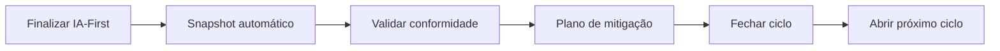

# Manual do módulo regulatório — Blueprint IA

Guia para **consultores SysMap** e **gestores** do cliente.

> Estimativas orientativas com base no assessment BluePrint e na avaliação IA-First. **Não constitui parecer jurídico nem certificação.**

---

## 1. Visão geral

O módulo cruza maturidade do projeto (D01–D16) com a avaliação **IA-First** de cada produto para estimar:

| Marco | O que indica |
|-------|----------------|
| **PL 2338/2023** | Classificação de risco do sistema de IA |
| **ISO/IEC 42001** | Conformidade estimada com gaps por dimensão |
| **LGPD** | Necessidade de RIPD, base legal, decisão automatizada |

---

## 2. Fluxo recomendado

1. **Dashboard do produto** — leia o bloco *Status regulatório*
2. **Validar conformidade** — confirme ou ajuste PL, LGPD, AIPD
3. **Plano de mitigação** — execute ações, anexe evidências
4. **Fechar ciclo** — congela snapshot no histórico
5. **Abrir próximo ciclo** — nova rodada (herda mitigações pendentes)

---

## 3. Validação do consultor

**Rota:** Dashboard produto → *Validar conformidade*

| Campo | Uso |
|-------|-----|
| Classificação PL | Confirmar ou rebaixar risco (ex.: ALTO → BAIXO) |
| Status AIPD | `não iniciada` / `em andamento` / `concluída` |
| Base legal LGPD | Obrigatória se RIPD provável |
| Override RIPD | Confirmar se RIPD é ou não necessário |
| Notas ISO / consultor | Contexto para auditoria interna |

**Recalcular snapshot:** mantém a validação do consultor por padrão. Use *recalcular sem preservar* apenas se quiser resetar tudo após nova IA-First.

---

## 4. Ciclos regulatórios

- Apenas **um ciclo aberto** por produto
- Vinculado à **versão aberta do projeto** (`ProjetoVersao`) quando existir
- **Checklist de fechamento:** validação, AIPD (se alto risco), base legal LGPD, mitigações críticas
- **Comparativo visual:** evolução PL / ISO / mitigações entre ciclos

---

## 5. Mitigações e evidências

No **Plano de mitigação**:

- Ações sugeridas automaticamente a partir dos motivos PL e gaps ISO
- Status: `planejada` → `em_andamento` → `concluída`
- **Anexos:** PDF, imagens ou TXT até 10 MB por arquivo
- URL externa continua disponível no campo legado `evidenciaUrl`

---

## 6. Dashboard do projeto

**Rota:** Dashboard projeto → *Dashboard regulatório completo*

- KPIs consolidados de todos os produtos
- **Plano 30 / 60 / 90 dias** gerado automaticamente
- **Alertas:** AIPD pendente, validação, ciclo parado, prazos de mitigação

**API:** `GET /api/regulatorio/dashboard/:projetoId`

---

## 7. Book IA e export

- **Seção 14** do Book: panorama regulatório + plano 30/60/90
- **Export ZIP da versão:** arquivo `05-conformidade-regulatoria.md`

---

## 8. Alertas (notificações)

`GET /api/regulatorio/notificacoes?projetoId=`

| Código | Significado |
|--------|-------------|
| `AIPD_PENDENTE` | Alto risco sem AIPD |
| `VALIDACAO_PENDENTE` | Consultor não validou |
| `LGPD_BASE_LEGAL` | RIPD provável sem base legal |
| `CICLO_PARADO` | Ciclo aberto há 30+ dias |
| `MITIGACAO_VENCIDA` | Prazo da mitigação passou |
| `CICLO_VERSAO_DESATUALIZADA` | Nova versão do projeto aberta |

---

## 9. Perfis com permissão de edição

`admin`, `gestor`, `sysmap`, `negocios`, `ti`, `executivo`

Avaliadores visualizam status, mas não editam validação nem mitigações.

---

## 10. Limitações conhecidas

- Estimativa automática ≠ parecer jurídico
- LGPD e PL são avaliações **independentes**
- Recalcular com `preservarValidacao=false` zera validação do consultor
- Ciclos regulatórios e versões de maturidade do projeto são **relacionados**, mas não idênticos

---

*SysMap Solutions · Blueprint IA · Módulo regulatório*
